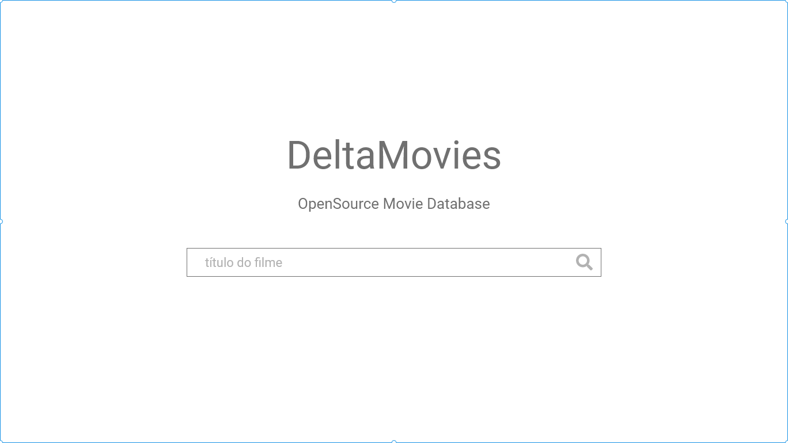

  

# O desafio
Para o desafio de `Frontend Developer`, você precisará desenvolver uma aplicação simulando uma base de dados de filmes online. Esperamos ver como resultado final algo parecido com:

[Versão online](https://xd.adobe.com/view/f1b2108b-efd3-4261-653e-cae8696ca6cf-8783/)

**OBS:** Fique à vontade para adicionar melhorias que julgue pertinente. Ex.: Adição de `typeahead` na tela de pesquisa.

### Funcionalidades
Pesquisa de filmes por `título`. Ex.: Die hard.

#####  Agrupamento
O resultados devem ser agrupados pelo atributo `Genre`.

#### Paginação
A pesquisa deve permitir a paginação dos resultados.

#### Detalhamento
Para cada resultado retornado, deve ser possível inspecionar seus detalhes.

### O que precisamos ver?
- Conhecimentos 100% focados em **frontend**:
  - Conhecimento de **HTML5** e **CSS3**;
  - Conhecimento de [ReactJS](https://reactjs.org/) ou [Vuejs](https://vuejs.org/) ou [Angular2 (ou posterior)](https://angular.io/);
  - Como organizar a estrutura da aplicação;
  - Domínio dos últimos recursos do framework escolhido, Ex. Se escolheu reactjs utilizar Redux, React Hooks, Context Api, Styled Components...etc

### O que gostaríamos de ver?
- Escrita de código limpo utilizando melhores práticas;
- Implementação de testes automatizados para garantia da qualidade de software;
- Uso de pré-processadores javascript (Typescript, Babel etc.) e css(Less, Sass etc.);
- Código que além de ser funcional tem desempenho acima da média.

### Diferenciais adicionais
- Conhecimento de AWS.
- Conhecimento de Graphql e arquiteturas Serveless.

### Colher de chá (=
- Aqui no desafio de Frontend pra ganhar agilidade conecte sua aplicação diretamente na API [OmdbAPI](http://www.omdbapi.com) e seja feliz!
  
### Como participar?
Basta nos enviar um email (`frederico@deltahub.com.br` ou `natan@deltahub.com.br`) com o seguinte assunto `VAGA - Frontend Developer` contendo o link (de preferência aqui mesmo no github) do repository com o código da solução.

**No mais**,

