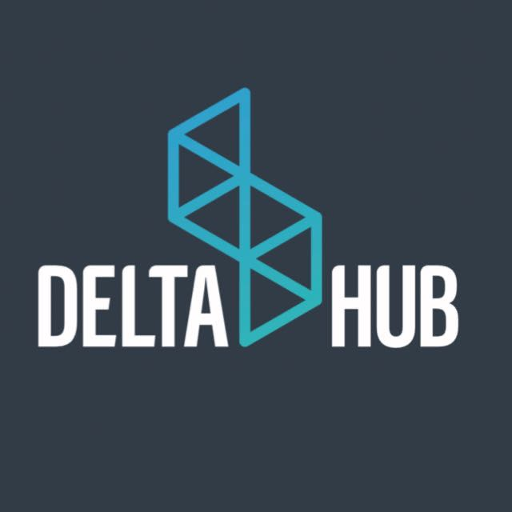
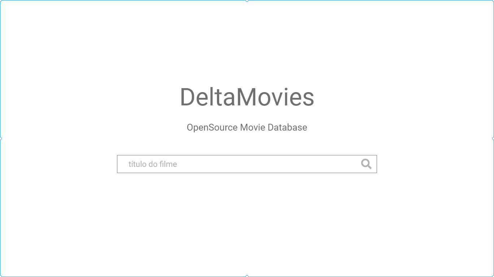
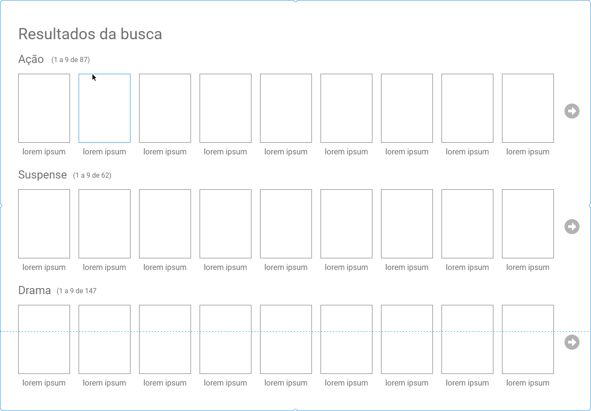
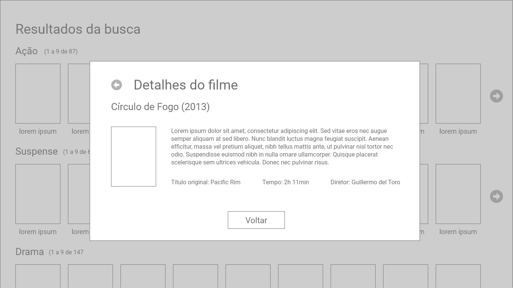

  

# O desafio
Para o desafio de `Fullstack Software Engineer`, você precisará desenvolver uma aplicação simulando uma base de dados de filmes online. Esperamos ver como resultado final algo parecido com:

[Versão online](https://xd.adobe.com/view/f1b2108b-efd3-4261-653e-cae8696ca6cf-8783/)

**OBS:** Fique à vontade para adicionar melhorias que julgue pertinente. Ex.: Adição de `typeahead` na tela de pesquisa.

### Funcionalidades
Pesquisa de filmes por `título`. Ex.: Die hard.

#####  Agrupamento
O resultados devem ser agrupados pelo atributo `Genre`.

#### Paginação
A pesquisa deve permitir a paginação dos resultados.

#### Detalhamento
Para cada resultado retornado, deve ser possível inspecionar seus detalhes.

### O que precisamos ver?
- Conhecimentos de **backend**:
  - Como montar uma aplicação com [Nodejs](https://nodejs.org/en/);
  - Como organizar a estrutura da aplicação:
	- Conhecimento dos códigos [HTTP](https://httpstatuses.com/) apropriados para os diferentes cenários;
	- Conhecimento sobre a arquitetura [REST](https://en.wikipedia.org/wiki/Representational_state_transfer);

- Conhecimentos de **frontend**:
  - Conhecimento de **HTML5** e **CSS3**;
  - Conhecimento de [ReactJS](https://reactjs.org/) ou [Vuejs](https://vuejs.org/) ou [Angular2 (ou posterior)](https://angular.io/);
  - Como organizar a estrutura da aplicação;

### O que gostaríamos de ver?
- Escrita de código limpo utilizando melhores práticas;
- Implementação de testes automatizados para garantia da qualidade de software;
- Uso de pré-processadores javascript (Typescript, Babel etc.) e css(Less, Sass etc.);
- Código que além de ser funcional tem desempenho acima da média.

### Diferenciais adicionais
- Conhecimento de AWS.
- Conhecimento de Graphql e arquiteturas Serveless.

### Colher de chá (=
- Decidimos ser bonzinhos e te poupar tempo de fazer o scrapping dos dados da [OmdbAPI](http://www.omdbapi.com)
  - Na pasta `data`, há 100 registros de filmes prontos para serem utilizados.

### Como participar?
Basta nos enviar um email (`frederico@deltahub.com.br` ou `natan@deltahub.com.br`) com o seguinte assunto `VAGA - Fullstack Software Engineer` contendo o link (de preferência aqui mesmo no github) do repository com o código da solução.

**No mais**,

